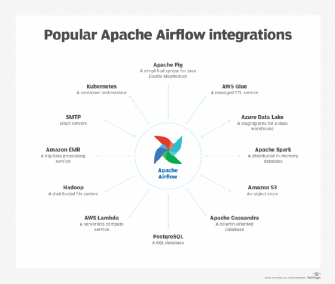
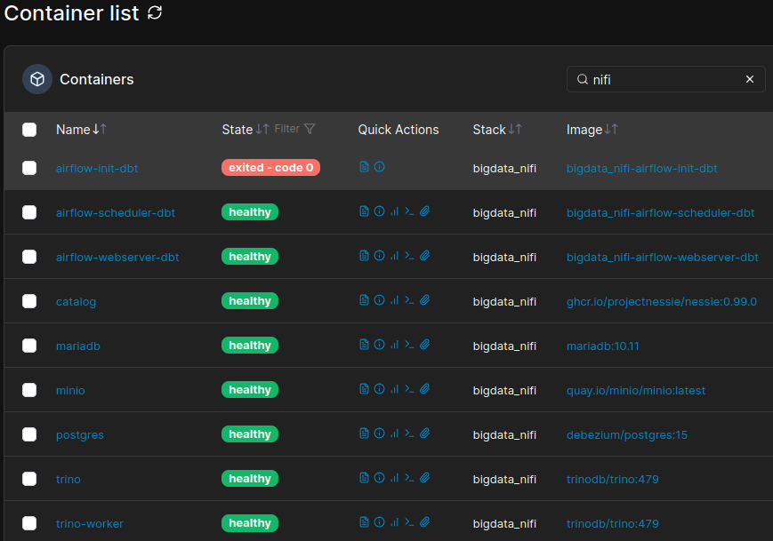
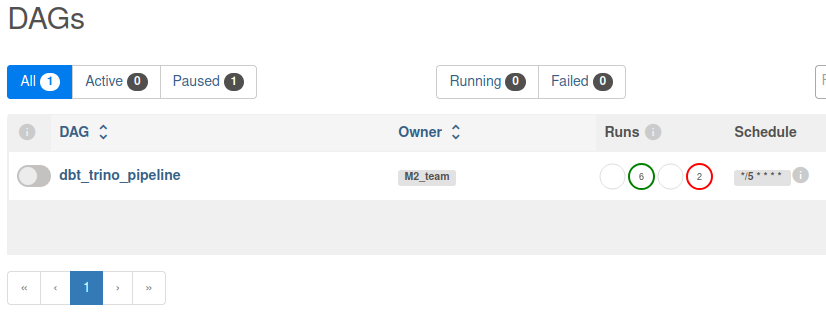
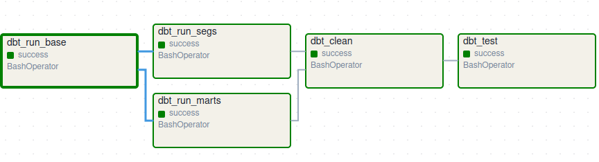
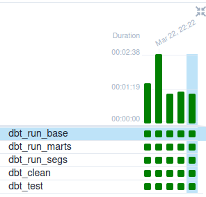
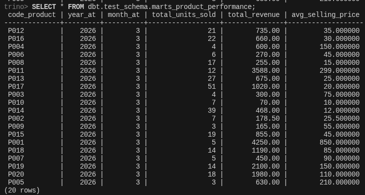
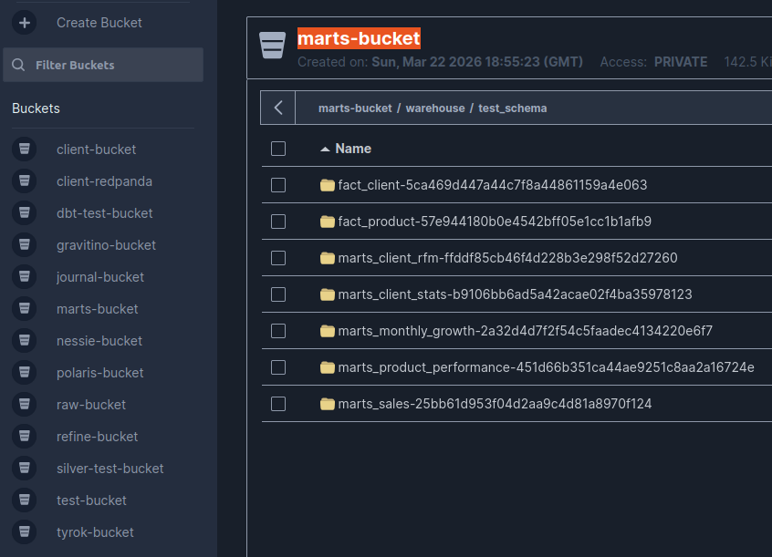

# 🦞 bigdata_nanp - AIRFLOW - dbt orchestration (airflow-dbt) — BigData airflow stack II

## **Intro**

We are going to orchestrate some dbt scripts

We are also going to use iceberg (nessie catalog)

airflow: user(`airflow`), password (`airflow`), bd(`airflow`)

---

## **PORTS & configs**

* **`UI`**:

  - **airflow webserver UI**: Default (http) -> `8080`, Exposed(http) -> `8090`. **`[http://localhost:8090]`**

---

    <picture>
        <source media="(prefers-color-scheme: light dark)" srcset="images/airflow1.png">
        
    </picture>

---

    <picture>
        <source media="(prefers-color-scheme: light dark)" srcset="images/airflow2.png">
        
    </picture>

---

## **Screenshots**

    <picture>
        <source media="(prefers-color-scheme: light dark)" srcset="images/portainer_container.png">
        
    </picture>

    <picture>
        <source media="(prefers-color-scheme: light dark)" srcset="images/list_dag.png">
        
    </picture>

    <picture>
        <source media="(prefers-color-scheme: light dark)" srcset="images/dag.png">
        
    </picture>

    <picture>
        <source media="(prefers-color-scheme: light dark)" srcset="images/task.png">
        
    </picture>

    <picture>
        <source media="(prefers-color-scheme: light dark)" srcset="images/trino_query.png">
        
    </picture>

    <picture>
        <source media="(prefers-color-scheme: light dark)" srcset="images/nessie_branch.png">
        
    </picture>

    <picture>
        <source media="(prefers-color-scheme: light dark)" srcset="images/bucket_content.png">
        
    </picture>

Enjoy!

