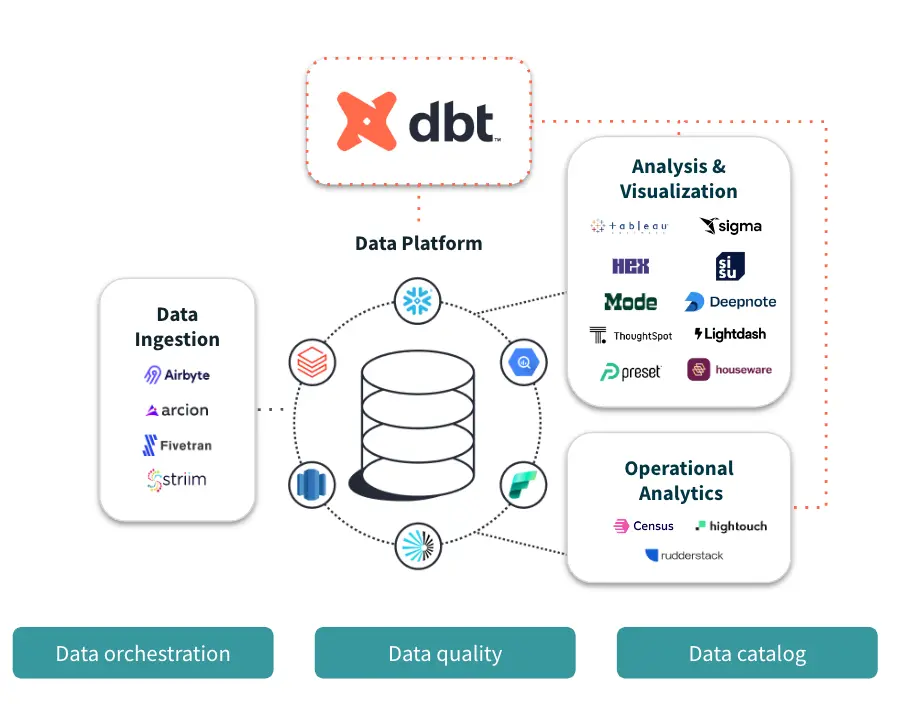
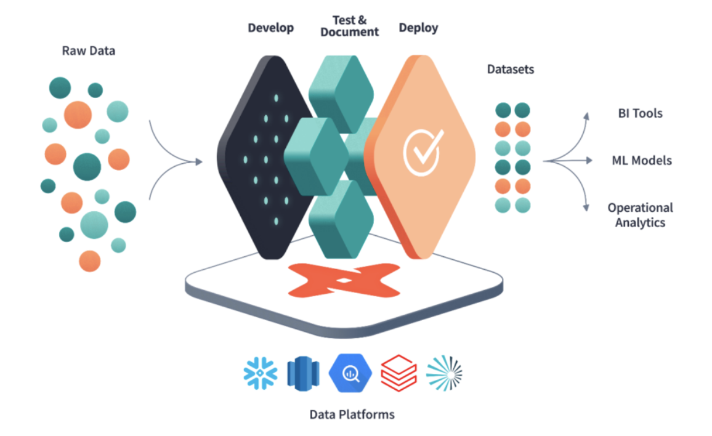
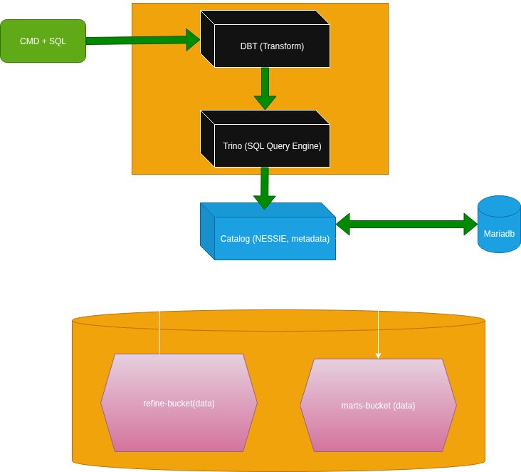
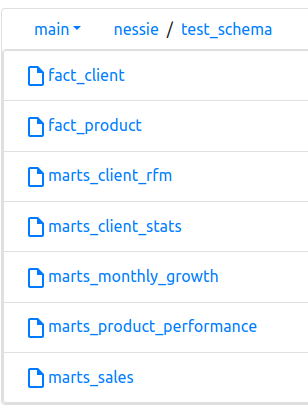

# 🦞 bigdata_nanp - DBT Processing (dbt-trino-Nessie-minio) — BigData catalog stack

## **What's dbt**

### definition:

* **`DBT`** stand for **Data Build Tool**

* **`Role`**:
  
  * It's a framework generaly used to `Transform` (E**T**L)datas.

  * Used to move or transform datas between [`stagging` - `intermediate` - `Marts`] | [`Bronze` - `Silver` - `Gold`] | [`Raw` - `Refine` - `Marts`].

* **`How it's work`**: use `SQL SELECT` (models) to apply transformations and `jinja & macros` as templates.

  * **`SQL Models`**: Compile your `SELECT query` and use it to create `tables` or `materialized views`.

  * **`Jinja & Macros`**: For `functions`, `vars` or `loops`.

  * **`Materialization`**: `tables`, `views` or `incremental`.

  * **`GIT`**: for `versioning`

* **`versions`**:
  
  * **`Dbt Core`**: Free one, work like python lib and use on `command line`.

  * **`Dbt Cloud`**: via `SaaS`, not free, with UI

* **`Commands`**:

  * **`dbt init [Project_name]`**: Set Up projet with files and folders

  * **`dbt debug`**: Checks connections to `warehouse` (`snowflake`, `Redshift`, `Databricks`, ...)

  * **`dbt test`** or **`dbt test --select [model_name]`**: Data quality testing (`NOT NULL`, `UNIQ`, ...)

  * **`dbt deps`**: install externals packages define in file `packages.yml` (`dbt-utils`, `dbt-expectations`, `codegen`, ...)

  * **`dbt run`** or **`dbt run --select [model_name]`** or **`dbt run --select [model_folder]`**: execute transformations on all models or a specific model

  * **`dbt run --full-refresh`**: rebuild all `increments` models.

  * **`dbt seed`**: Transform files in `seed` folder (`files.csv`, `files.xlsx`, ...)

  * **`dbt snapshot`**: Create snapshot of slowly changes (a client address changing not aften happen)

---
<p align="center">
    <picture>
        <source media="(prefers-color-scheme: light dark)" srcset="images/dbt1.png">
        
    </picture>
</p>

---

<p align="center">
    <picture>
        <source media="(prefers-color-scheme: light dark)" srcset="images/dbt2.png">
        
    </picture>
</p>

---

## **Our Architecture**

In `spark-nessie` project (notebook `nessie_spark_agence.ipynb`), we transform datas from `raw-bucket/[client,product,sales]` to tables `nessie.agence.[client,product,sales]` (`refine-bucket`).

In the same project we use `nessie` as catalog and store data in `minio` bucket `refine-bucket`. (see `nessie.properties` file in `trino/config/catalog`).

Now, our goal is to transform data in `nessie.agence.*` into `KPI (Key Performance Indicator)` and store result in tables or views `dbt.test_schema.*`.

We will use:

* `DBT` env to run queries

* `yaml` files for configs

* `.sql` files for models

<p align="center">
    <picture>
        <source media="(prefers-color-scheme: light dark)" srcset="images/archi.drawio.png">
        
    </picture>
</p>

<p align="center">
  <a href="LICENSE"></a>
</p>

---

This **Stack** is a simple *BigData Processing stack using DBT* running over *Docker*.

It will help you to deploy and test a simple **Processing** pipeline using **Docker**, **DBT(SQL)**, **Trino(SQL Engine)** and **nessie(catalog)**

---

**Note: the most usefull are `minio, dbt, trino, catalog, mariadb`.**

## **Components:**

- **minio:** source (`refine-bucket`) & store result in `marts-bucket`. In this case you don't have to worry about these buckets and what's inside, all you have to do is to setup configs in file `dbt.properties` and `nessie.properties`. `Trino` and `nessie` will take care of everything for you.

- **catalog:** `nessie` version for iceberg catalog. store metadata in `maridb` and datas in `minio` buckets `refine-data` and `marts-bucket`.

  * `nessie.properties` is source config file. `nessie.properties` work with `refine-bucket`.
  
  * `dbt.properties` is dest or result config file. `dbt.properties` work with `marts-bucket`

- **mariadb:** store `nessie` metadata in database `nessie_metadata`. user is `mariadb` and password is `password`.

- **Trino cluster:** Spread over two nodes (`trino`, `trino-worker`). Use as `SQL Query Engine`. Manage datas inside `minio bucket` throw `nessie catalog`. **NOTES:** If it's take too much resources, comment or shutdown `trino-worker` and update configs files.

- **Dbt:** Implements KPI transformation needed. models are store in folder `dbt/app/models`.

---

## **Files & Folders:**

1- **images:** contains screenshot.

2- **notes:** some `example scripts`:

- `first_test.sql`: basic example of using trino with nessie and minio over trino shell. it's use catalog `nessie`

- `second_test.sql`: basic example of using trino with nessie and minio over trino shell. it's use catalog `dbt`

3- **trino:** some `trino` config files:

* **`trino master`**:

  - `config-coordinator.properties`: trino master node config.

  - `node-coordinator.properties`: trino master config use to set master `node.id` & `node.data-dir` location for persist storage.

* **`trino worker`**:

  - `config-worker.properties`: trino worker node config. set location of trino master.

  - `node-worker-1.properties`: trino worker 1 config use to set worker `node.id` & `node.data-dir` location for persist storage.

* **`trino resources & logs`**:

  - `config/jvm.config`: trino nodes resources config.

  - `config/log.properties`: trino nodes logs config.

* **`trino catalogs & connections`**:

  - `config/catalog/nessie.properties`: use by trino to connect with `nessie catalog` and manage schemas and tables inside `nessie.*`.

  - `config/catalog/dbt.properties`: use by trino to connect with `nessie catalog` and manage schemas and tables inside `dbt.*`.

4- **dbt:** dbt image build, config and models.

- `Dockerfile`: use to build dbt docker image based on `python:3.11-slim`.

* **`dbt project config`**:

  - `app/dbt_project.yml`: Set up your dbt project.

  - `app/profiles.yml`: config profiles to write KPI data dest (`dbt.test_schema.*`) via `trino`. `dev` profile is use for testing, once everything is ok, you can switch to `prod` profile.

  - `app/models/sources.yml`: config profiles to access to data source (`nessie.agence.*`) via `trino`.

* **`dbt models`**:

  - `app/models/[facts,marts,segment]`: sql models files use to transform data via `trino`.

  - **NOTES**: Every files here will represent a `table` inside `dbt.test_schema.*`. Example: `app/models/marts/marts_client_stats.sql` will create table `dbt.test_schema.marts_client_stats`.

---

## **PORTS & configs**

* **`UI`**:

  - **Minio UI**: Default -> `9001`, Exposed -> `9031`. **`[http://localhost:9031]`**

  - **Trino UI**: Default (http) -> `8080`, Exposed(http) -> `18080`. **`[http://localhost:18080]`**

  - **DBT doc UI**: Default (http) -> `8081`, Exposed(http) -> `18081`. **`[http://localhost:18081]`**

* **`API`**:

  - **Minio API S3**: Default -> `9000`, Exposed -> `9030`

  - **Nessie API***: Default -> `19120`, Exposed -> `19720`

  - **Mariadb***: Default -> `3306`, Exposed -> `3416`

---

### **Volumes**
before you start the docker stack, make sure to change volumes locations

```yml

volumes:
  minio_data:
    driver: local # Define the driver and options under the volume name
    driver_opts:
      type: none
      device: /Change/Path/minio
      o: bind
  mariadb_data:
    driver: local # Define the driver and options under the volume name
    driver_opts:
      type: none
      device: /Change/Path/mariadb
      o: bind
  share_data:
    driver: local # Define the driver and options under the volume name
    driver_opts:
      type: none
      device: /Change/Path/share_folder
      o: bind
```

---

### **Configs & setup**

* #### **Step 1:** Create all volumes folders inside your main host (see volumes above)

* #### **step 2:** Clone the repo and move to folder **`dbt-nessie`**

* #### **step 3:** Change volumes path inside **`compose.yml`** file under section **`volumes:`** (see above)

* #### **step 4:** Start your project inside **`compose.yml`**.

```sh
# Be sure to be in the folder with compose.yml file
# start all
docker compose up -d
```

* #### **step 5 (if not yet):** if not yet, create bucket **`marts-bucket`**.

* #### **step 6:** we Consider bucket **`refine-bucket`** already fill with `spark-nessie project`.

---

### **Run project & some cleaning ops**

```sh
# Be sure to be in the folder with compose.yml file
# start all
docker compose up -d

# stop all and clean some volume
docker compose down -v --remove-orphans
```

---

### **Troubleshooting**

* #### **delete minio bucket:** you can use **minio UI** container to recreate all bucket.

```sh
# delete a bucket
docker exec minio mc rb --force myalias/[nom-du-bucket]
```

---

### **DBT - Some commands**

* #### **`Trino` hosts - SHELL**

```bash
# connection (with 'nessie' catalog as entry database )
docker exec -it trino trino --catalog nessie
# If you don't want to stay connect in trino use this instead:
# docker exec -it trino trino --execute "[QUERY];"
# example:
docker exec -it trino trino --execute "SELECT * FROM nessie.agence.client;"

# You will see prompt like this 'trino>'.
# Now you can run your SQL queries
```

* #### **`Trino` hosts - SQL**

```sql
-- now for the rest, we assume that your on trino prompt.

-- SOURCES: nessie.agence.client, nessie.agence.product, nessie.agence.sales
-- Check if 'refine' data are there first.
SELECT * FROM nessie.agence.client;
SELECT * FROM nessie.agence.product;
SELECT * FROM nessie.agence.sales;

-- AFTER DBT TRANSFORMS 'dev profile': dbt.test_schema.fact_client, dbt.test_schema.fact_product, dbt.test_schema.marts_sales
SELECT * FROM dbt.test_schema.fact_client;
SELECT * FROM dbt.test_schema.fact_product;
SELECT * FROM dbt.test_schema.marts_sales;

SELECT * FROM dbt.test_schema.marts_client_stats;
SELECT * FROM dbt.test_schema.marts_monthly_growth;
SELECT * FROM dbt.test_schema.marts_product_performance;
SELECT * FROM dbt.test_schema.marts_client_rfm;
```


* #### **some `dbt` commands**

```bash
docker exec -it dbt bash
# now we assume that your in dbt host

# move to base folder
cd /usr/app

## -- CHECK AND TEST

dbt --version # check dbt version

# install deps
dbt deps

# clean all run and compile files generated
dbt clean

# check all connections status in dbt configs
dbt debug

# test data quality in your dbt config and models
dbt test

# list all project resources
dbt list

# compile your project (dbt run also do it).
# It will create a 'target' folder with all sql queries in 'clear' sentences.
dbt compile

## -- RUN: you can choose one way or combine multiple ways to run your dbt models.

# run all your models
dbt run

# refresh all your models
dbt run --full-refresh

# run a specific models
dbt run --select [model].sql
dbt run --select marts_product_performance.sql

# run all models in a folder
dbt run --select [folder_model]
dbt run --select marts

## -- DOCS: generate some documentation of your project, accessible via web
dbt docs generate # generate web documentation
# run local server (http://localhost:8001)
# first, expose port 8001 in your compose.yml file
dbt docs serve --host 0.0.0.0 --port 8001 
```

---

## **Screenshots**

<p align="center">
    <picture>
        <source media="(prefers-color-scheme: light dark)" srcset="images/portainer_container.png">
        
    </picture>
</p>

<p align="center">
    <picture>
        <source media="(prefers-color-scheme: light dark)" srcset="images/bucket_content.png">
        
    </picture>
</p>

<p align="center">
    <picture>
        <source media="(prefers-color-scheme: light dark)" srcset="images/trino_query.png">
        
    </picture>
</p>

<p align="center">
    <picture>
        <source media="(prefers-color-scheme: light dark)" srcset="images/nessie_branch.png">
        
    </picture>
</p>

Enjoy!


