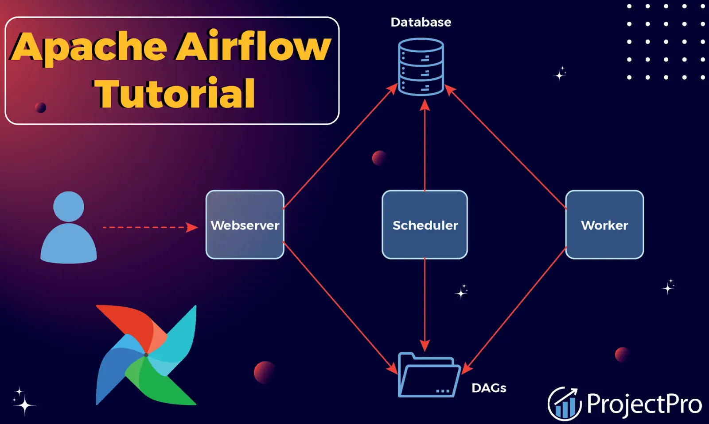
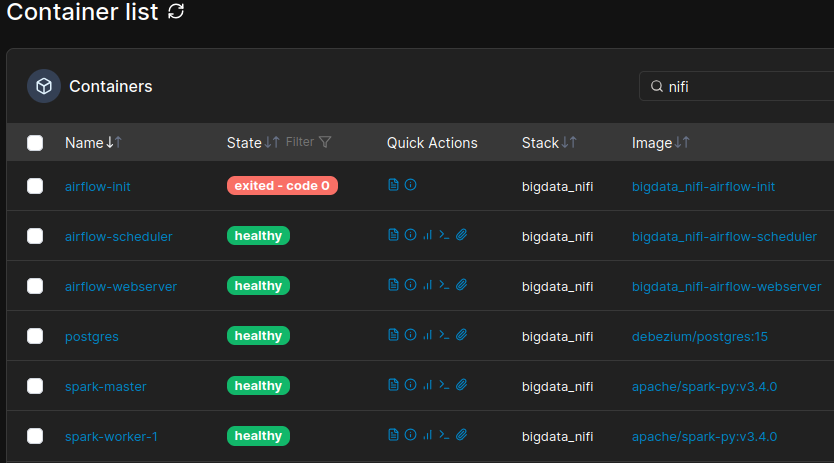
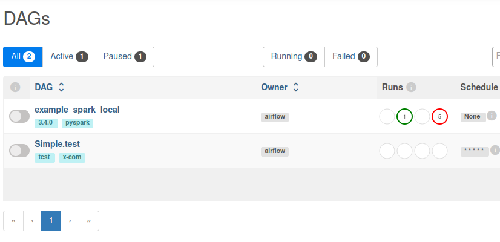
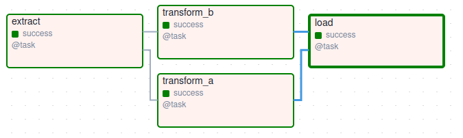
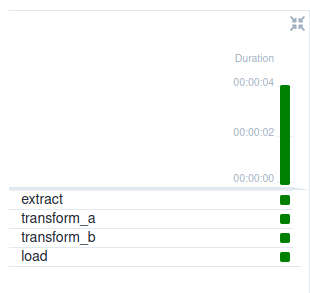
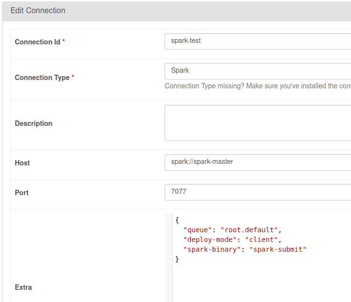
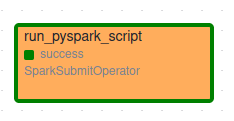
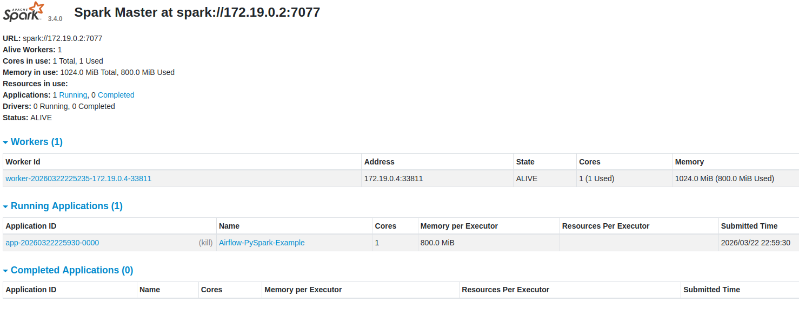

# 🦞 bigdata_nanp - AIRFLOW - spark orchestration (airflow-spark) — BigData airflow stack I

## **Intro**

We are going to orchestrate some scripts

We are also going to call spark cluster

airflow: user(`airflow`), password (`airflow`), bd(`airflow`)

---

## **PORTS & configs**

* **`UI`**:

  - **airflow webserver UI**: Default (http) -> `8080`, Exposed(http) -> `8090`. **`[http://localhost:8090]`**

---

    <picture>
        <source media="(prefers-color-scheme: light dark)" srcset="images/airflow1.png">
        
    </picture>

---

    <picture>
        <source media="(prefers-color-scheme: light dark)" srcset="images/airflow2.png">
        
    </picture>

---

## **Screenshots**

    <picture>
        <source media="(prefers-color-scheme: light dark)" srcset="images/containers.png">
        
    </picture>

    <picture>
        <source media="(prefers-color-scheme: light dark)" srcset="images/dag_list.png">
        
    </picture>

    <picture>
        <source media="(prefers-color-scheme: light dark)" srcset="images/graph_simple_test.png">
        
    </picture>

    <picture>
        <source media="(prefers-color-scheme: light dark)" srcset="images/task_simple_test.png">
        
    </picture>

    <picture>
        <source media="(prefers-color-scheme: light dark)" srcset="images/spark_conn.png">
        
    </picture>

    <picture>
        <source media="(prefers-color-scheme: light dark)" srcset="images/graph_pyspark.png">
        
    </picture>

    <picture>
        <source media="(prefers-color-scheme: light dark)" srcset="images/spark_ui_jobs.png">
        
    </picture>

Enjoy!

