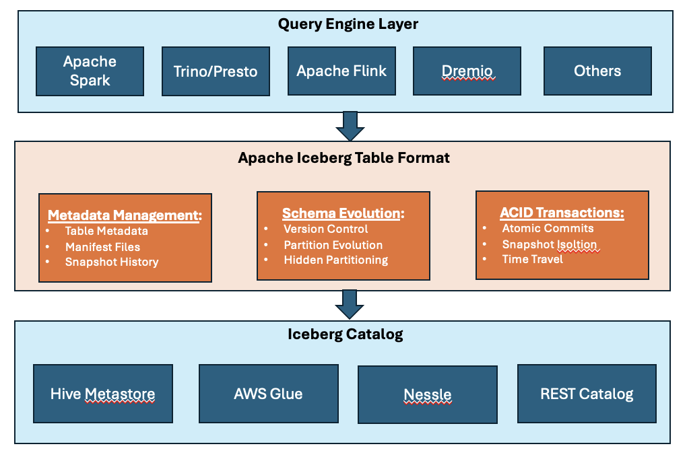
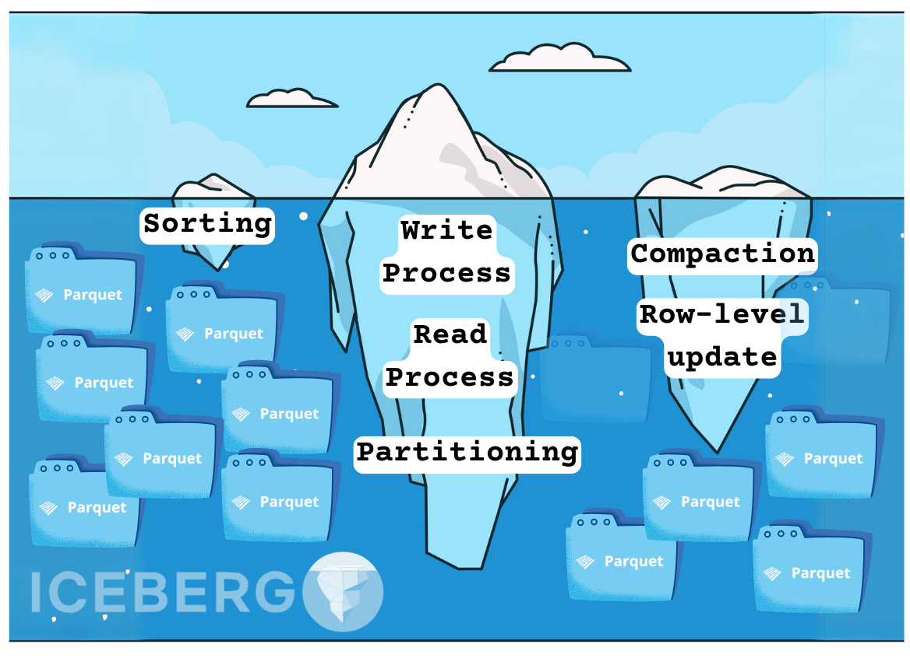
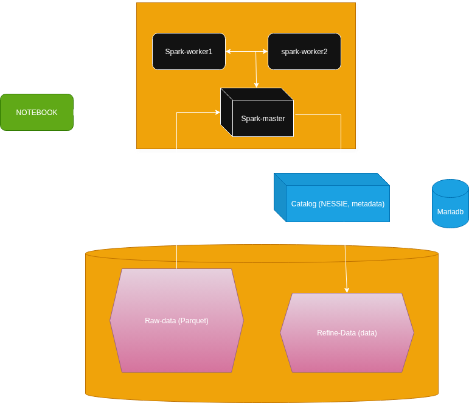

# 🦞 bigdata_nanp - ICEBERG CATALOG (Nessie) — BigData catalog stack

## **What's a cataog**

---
<p align="center">
    <picture>
        <source media="(prefers-color-scheme: light dark)" srcset="images/iceberg4.png">
        
    </picture>
</p>

---

<p align="center">
    <picture>
        <source media="(prefers-color-scheme: light dark)" srcset="images/iceberg2.png">
        
    </picture>
</p>

## **Our Architecture**

Tools (`Python`) used to process `.parquet` files store in a `minio` bucket throw catalo (`nessie`)

First of all we consider, you're able to ingest (`streaming`, `batch`) data from  majors sources (`Mysql`, `files`. ...), an store them in `Minio`.

For example purpose, your datas (`client`, `product` and `sales`) are stored in buckets `raw-bucket/[client|product|sales]/*.parquet`.

We are going to store **`refine datas`** in bucket `refine-data` using `iceberg catalog` implementation **`nessie`**


<p align="center">
    <picture>
        <source media="(prefers-color-scheme: light dark)" srcset="images/archi.drawio.png">
        
    </picture>
</p>

<p align="center">
  <a href="LICENSE"></a>
</p>

---

**Stack** is a simple *BigData Processing stack using catalog* running over *Docker*.

It will help you to deploy and test a simple **Processing** pipeline using **Docker**, **Spark(pyspark)** and **nessie(catalog)**

---

**Note: the most usefull are `minio, spark-master, jupyter-pyspark, catalog, mariadb`.**

## **Components:**

- **minio:** source & store result in `parquet` format. It use bucket `raw-redpanda` for source and `refine-bucket` for dastination.

- **catalog:** `nessie` version for iceberg catalog. store metadata in `maridb` and datas in `minio` bucket `refine-data`.

- **mariadb:** store `nessie` metadata in database `nessie_metadata`. user is `mariadb` and password is `password`.

- **spark cluster:** Spread over three nodes (`spark-master`, `spark-worker1`, `spark-worker2`). used to process datas in `raw-bucket` ( `client`, `product`, `sales`). `saprk-master` act as `master node` and the two others as `slave or workers nodes`. **NOTES:** If it's take too much resources, comment or shutdown `spark-worker1` or `spark-worker2` or also transform `spark-master` as **master** and **worker** at the same time.

- **jupyter-pyspark:** Notebook, connect to `spark cluster` and used to run `pyspark` scripts.

---

## **Files & Folders:**

1- **images:** contains screenshot.

2- **notes:** some `python scripts`:

- `first_nessie_spark.py`: basic example of using spark with nessie and minio

- `nessie_spark_agence.py`: use `spark iceberg catalog` to store in `refine-bucket`.

- `job.py`: will help you to run a simple `pyspark` script in command line.

3- **notebooks:** some `notebooks`:

- `first_nessie_spark.ipynb`: basic notebook example of using spark with nessie and minio

- `nessie_spark_agence.ipynb`: use `spark iceberg catalog` to store in `refine-bucket`.

4- **datas:** contains 3 files, but only 2 are usefull.

- `client_bucket_topics.zip`: datas to upload in bucket `client-bucket`.

- `raw_bucket_client_product_sales_parquet.zip`: datas to upload in bucket `raw-bucket`.

---

## **PORTS & configs**

- **Minio UI**: Default -> `9001`, Exposed -> `9031`. **`[http://localhost:9031]`**

- **Minio API S3**: Default -> `9000`, Exposed -> `9030`

- **Nessie API***: Default -> `19120`, Exposed -> `19720`

- **Mariadb***: Default -> `3306`, Exposed -> `3416`

- **spark-master**: Default (http) -> `8080`, Exposed(http) -> `8980`. **`[http://localhost:8980]`**

- **Jupyter Notebooks**: Default -> `8888`, Exposed -> `8988`. **`[http://localhost:8988]`**

---

### **Volumes**
before you start the docker stack, make sure to change volumes locations

```yml

volumes:
  pyspark_data:
    driver: local # Define the driver and options under the volume name
    driver_opts:
      type: none
      device: /Change/Path/pyspark
      o: bind
  jupyter_pyspark_data:
    driver: local # Define the driver and options under the volume name
    driver_opts:
      type: none
      device: /Change/Path/jupyter-pyspark
      o: bind
  minio_data:
    driver: local # Define the driver and options under the volume name
    driver_opts:
      type: none
      device: /Change/Path/minio
      o: bind
  mariadb_data:
    driver: local # Define the driver and options under the volume name
    driver_opts:
      type: none
      device: /Change/Path/mariadb
      o: bind
  share_data:
    driver: local # Define the driver and options under the volume name
    driver_opts:
      type: none
      device: /Change/Path/share_folder
      o: bind
```

---

### **Configs & setup**

* #### **Step 1:** Create all volumes folders inside your main host (see volumes above)

* #### **step 2:** Clone the repo and move to folder **`saprk-nessie`**

* #### **step 3:** Change volumes path inside **`compose.yml`** file under section **`volumes:`** (see above)

* #### **step 4:** Start your project inside **`compose.yml`**.

```sh
# Be sure to be in the folder with compose.yml file
# start all
docker compose up -d
```

* #### **step 5 (if not yet):** if not yet, create bucket **`raw-bucket`**.

* #### **step 6:** if not yet, create bucket **`refine-bucket`**.

* #### **step 7:** unzip files **`datas/raw_bucket_client_product_sales_parquet.zip`** and import folders **`client, product and sales`** inside bucket **`raw-bucket`**.

* #### **step 8:** also import notebooks **`notebooks/*.ipynb`** inside **`work`** folder in jupyter.

* #### **step 9 (if you don't want to download jars online):** unzip jars files and copy all of them inside folder `./jars`. (don't forget to used the folder `/home/jovyan/jars` to import all your jars in notebook, instead of downloading)


---

### **Run project & some cleaning ops**

```sh
# Be sure to be in the folder with compose.yml file
# start all
docker compose up -d

# stop all and clean some volume
docker compose down -v --remove-orphans
```

---

### **Troubleshooting**

* #### **delete minio bucket:** you can use **minio UI** container to recreate all bucket.

```sh
# delete a bucket
docker exec minio mc rb --force myalias/[nom-du-bucket]
```

---

### **Some commands**

* #### **Launch spark in command line**

  * **`pyspark-shell:`** spark command line `interpreter`, like notebook.

  * **`spark-submit:`** use to run some existing spark script.
  
  * **Some Args**
  
    * **`--master [URL_MASTER]:`** `[URL_MASTER]` can be `local[*]`, `yarn`, `spark://host:port`, `k8s://...`. Specify cluster manager. In our case it's **`--master spark://spark-master:7077`**.

    * **`--py-files:`** list of additionnals files dependencies `.py`, `.zip`, `.egg` adding to `PYTHONPATH`. In our case we don't have additionnal files.
    * **`--files:`** list of datas files distributed to every executors (`.csv`, `.json`).

    * **`--conf:`** properties (ex: `spark.executor.memory=800m`).

    * **`--packges:`** list of packages needed by your spark workflow. **`!!! if these packages doesn't exist, spark will download all of them form central repository`**. In our case: `--packages org.apache.hadoop:hadoop-aws:3.3.4,com.amazonaws:aws-java-sdk-bundle:1.12.262`.

    * **`--jars:`** comma separeted list of jars path.
    
  ```sh
  spark-submit job.py
  ```

* #### **example RUN:**

```bash
# 1. connect to docker image jupyter-pyspark
# as ROOT
docker exec -it jupyter-pyspark bash
# or as user (jovyan)
docker exec -it --user jovyan jupyter-pyspark bash -l

# 2. run this command (interpreter or run script):
# INTERPRETER:
pyspark --packages org.apache.hadoop:hadoop-aws:3.3.4,com.amazonaws:aws-java-sdk-bundle:1.12.262
# or RUN SCRIPT job.py
spark-submit --packages org.apache.hadoop:hadoop-aws:3.3.4,com.amazonaws:aws-java-sdk-bundle:1.12.262 /notes/job.py


```

---

## **Project**

Enjoy!


