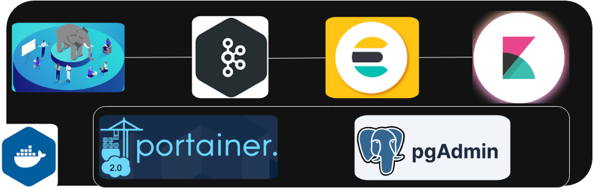
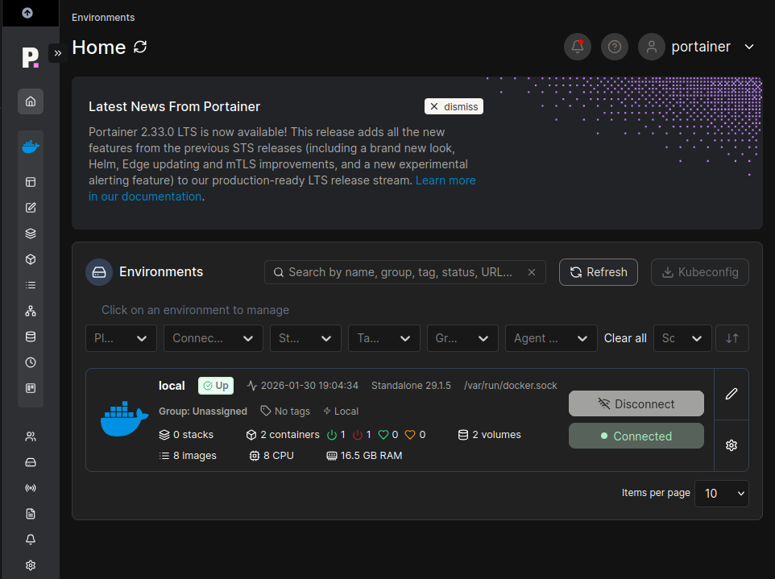
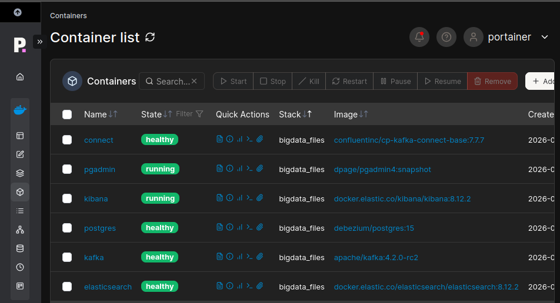
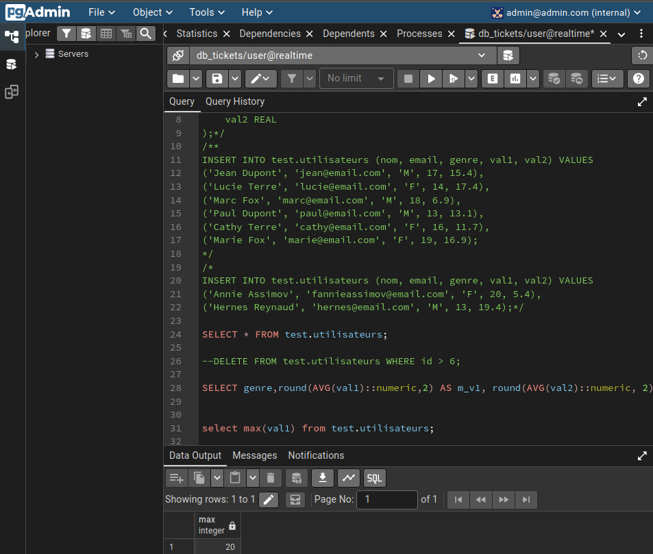
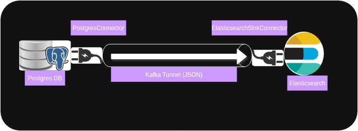
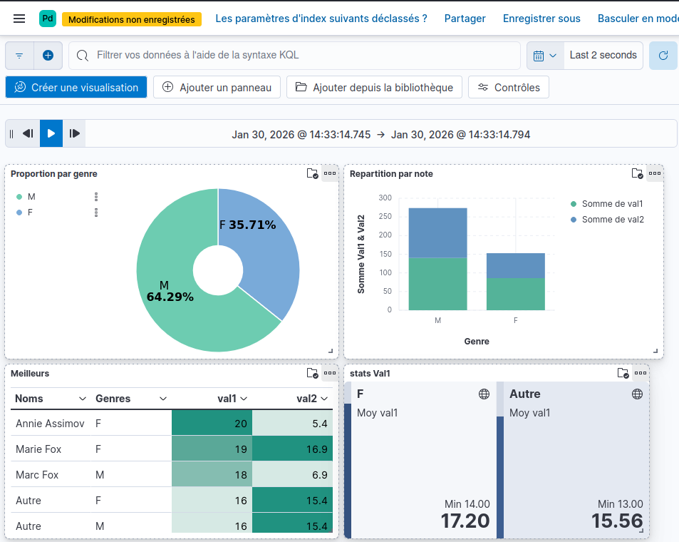

# 🦞 Stack-Stream — BigData stream stack (docker)

<p align="center">
    <picture>
        <source media="(prefers-color-scheme: light dark)" srcset="images/archi_globale.drawio.png">
        
    </picture>
</p>

<p align="center">
  <strong>EXPLOIT DATA FROM POSTGRES DATABASE</strong>
</p>

<p align="center">
  <a href="LICENSE"></a>
</p>

**Stack-Stream** is a simple *BigData stream stack* running over *Docker*.
It will help you to deploy and test a simple **streaming** pipeline using **Docker**.

**Components:**
- **[Docker](https://www.docker.com/)** (safer container ecosystem)
- **[Postgres DB](https://www.postgresql.org/)** (Advanced Open Source Relational Database)
- **[Kafka](https://kafka.apache.org/)** (open-source distributed event streaming platform)
- **[Confluent Connectors](https://www.confluent.io/product/connectors/)** (open-source connectors & sinks for streaming platform)
- **[Elasticsearch](https://www.elastic.co/elasticsearch/)** (open source, distributed search and analytics engine)
- **[Kibana](https://www.elastic.co/kibana/)** (open source interface to query, analyze, visualize, and manage your data stored in Elasticsearch)
- **[PgAdmin](https://www.pgadmin.org/)** (PostgreSQL Admin Tool)
- **[Portainer](https://www.portainer.io/)** (Kubernetes, Docker & Podman management.)

## Versions

* SE: **Ubuntu 22.04.5 LTS**
* Runtime enviromment for test: **Docker version 29.1.5**.
* Browser: **Opera 126.x**
* Others versions: in **compose.yml**

## PORTS

- **Postgres**: Default -> `5432`, Exposed -> `5432`
- **Portainer**: Default -> `443`, Exposed -> `7443`
- **Connect**: Default -> `8083`, Exposed -> `8083`
- **Kafka**: Default -> `9092`, Exposed -> `9092`
- **Pgadmin**: Default -> `80`, Exposed -> `5050`
- **Elasticsearch**: Default -> `9200`, Exposed -> `9200`
- **Kibana**: Default -> `5601`, Exposed -> `5601`

## Install

### Docker (if not already installed)

- **[Install](https://docs.docker.com/engine/install/)**


```bash
# prerequises
sudo apt update
sudo apt install ca-certificates curl gnupg lsb-release -y

# Add GPG keys
sudo install -m 0755 -d /etc/apt/keyrings
sudo curl -fsSL https://download.docker.com/linux/ubuntu/gpg -o /etc/apt/keyrings/docker.asc
sudo chmod a+r /etc/apt/keyrings/docker.asc

# Add the repository to Apt sources:
sudo tee /etc/apt/sources.list.d/docker.sources <<EOF
Types: deb
URIs: https://download.docker.com/linux/ubuntu
Suites: $(. /etc/os-release && echo "${UBUNTU_CODENAME:-$VERSION_CODENAME}")
Components: stable
Signed-By: /etc/apt/keyrings/docker.asc
EOF

# Update repository & install docker
sudo apt update
sudo apt install docker-ce docker-ce-cli containerd.io docker-buildx-plugin docker-compose-plugin
```

- **<u>Docker service</u>** 
```bash
# start & stop & status
sudo systemctl status docker
sudo systemctl start docker
sudo systemctl stop docker
```

- **<u>User access Config</u>**
```bash
# configure user
sudo groupadd docker # add group if not exist
sudo usermod -aG docker $USER
newgrp docker # Or restart session
```
---

### Portainer
```bash
# Create Docker Volume 'portainer_data'
sudo docker volume create --driver local --opt type=none --opt device={path_to_your_local_folder} --opt o=bind portainer_data

# Inspect the volume (check)
docker volume inspect portainer_data

# Start Portainer
sudo docker run -d -p 7003:8000 -p 7443:9443 --name portainer --restart=always -v /var/run/docker.sock:/var/run/docker.sock -v /run/docker.sock:/run/docker.sock -v portainer_data:/data portainer/portainer-ce:latest
```

#### Access from browser **`https://localhost:7443`**

<p align="center">
    <picture>
        <source media="(prefers-color-scheme: light dark)" srcset="images/Screenshot_portainer_1.png">
        
    </picture>
</p>

---

### Clone the project

- **<u>GIT (SSH)</u>** 
```bash
# clone
git clone git@github.com:ngoupatrick/stack-stream.git
```
---

### Run project & some cleaning ops

```bash
# Be sure to be in the folder with compose.yml file
# start all
docker compose up -d

# stop all and clean some volume
docker compose down -v --remove-orphans

# logs (you can also have access to logs on portainer)
docker logs -f {container}

# Bash access of specific container
docker exec -it {container} bash

# remove unused images
docker image prune -a

# remove all container not used for the last 24h
docker container prune --filter "until=24h"

# remove unused volume
docker volume prune
```

#### **result** (You can have access to **logs, console, inspect and stack** of each container throw **Portainer**)
<p align="center">
    <picture>
        <source media="(prefers-color-scheme: light dark)" srcset="images/Screenshot_portainer_2.png">
        
    </picture>
</p>

---
## Source

### Postgres
```bash
# you must first acces to postgres container
docker exec -it postgres bash

# some postgres commands
# 1- connect to a database: psql -h [hôte] -p [port] -U [utilisateur] -d [nom_base] -W
psql -h postgres -p 5432 -U user -d db_tickets -W # password in compose.yml
```

| **<span style="color:green">Commands</span>** | **<span style="color:green">Description</span>** |
| :--- | :--- | 
| **\l** | `Lister toutes les bases de données.` |
| **\dn** | `Lister les schemas` |
| **\c [nom_base]** | `Changer de base de données (se reconnecter).` |
| **\dt** | `Lister les tables de la base actuelle.` |
| **\d [table]** | `Décrire la structure d'une table spécifique.` |
| **\conninfo** | `Afficher les détails de la connexion actuelle.` |
| **\q** | `Quitter psql.` |

---

### PgAdmin

```sql
-- create schema 'test'
CREATE SCHEMA IF NOT EXISTS test;

-- create table 'test.utilisateurs'
CREATE TABLE IF NOT EXISTS test.utilisateurs (
    id SERIAL PRIMARY KEY,              -- Identifiant auto-incrémenté et clé primaire
    nom VARCHAR(100) NOT NULL,          -- Texte limité à 100 caractères, obligatoire
    email VARCHAR(255),
    date_inscription DATE DEFAULT CURRENT_DATE, -- Valeur par défaut (date du jour)
    genre VARCHAR(10) CHECK (genre IN ('M', 'F')),
    val1 INTEGER CHECK (val1 >= 0) NOT NULL,
    val2 REAL
);

-- Insert some data
INSERT INTO test.utilisateurs (nom, email, genre, val1, val2) VALUES 
('Jean Dupont', 'jean@email.com', 'M', 17, 15.4),
('Lucie Terre', 'lucie@email.com', 'F', 14, 17.4),
('Marc Fox', 'marc@email.com', 'M', 18, 6.9),
('Paul Dupont', 'paul@email.com', 'M', 13, 13.1),
('Cathy Terre', 'cathy@email.com', 'F', 16, 11.7),
('Marie Fox', 'marie@email.com', 'F', 19, 16.9);

-- Select
SELECT * FROM test.utilisateurs;

-- DELETE
DELETE FROM test.utilisateurs WHERE id > 6;

-- average 'val1' and 'val2' group by gender
select genre, round(avg(val1)::numeric,2) as m_v1, round(avg(val2)::numeric, 2) as m_v2 from test.utilisateurs group by genre;
```
RESULT
<p align="center">
    <picture>
        <source media="(prefers-color-scheme: light dark)" srcset="images/Screenshot_pgadmin.png">
        
    </picture>
</p>

---

## Streaming ingestion

**Tunnel**
<p align="center">
    <picture>
        <source media="(prefers-color-scheme: light dark)" srcset="images/Archi_tunnel.drawio.png">
        
    </picture>
</p>

Data are ingest from `Postgres DB` to `Elasticsaerch` throw `Kafka Tunnel`</br>
You can use **[KSQL](https://www.confluent.io/product/ksqldb/)** (real-time processing), to process data in flight inside `kafka` via SQL-like commands

### kafka

After setup your docker stack, you can use commands to manage `kafka` or use any UI solution

```bash
# Some Commands (you can run all these commands inside kafka container)
# first move to folder /opt/kafka/bin

# list all topics
./kafka-topics.sh --list --bootstrap-server localhost:9092

# create a topic (not necessary in this case)
./kafka-topics.sh --create --topic {topic-name} --bootstrap-server localhost:9092 --partitions 3 --replication-factor 1

# Describe a topic
./kafka-topics.sh --describe --topic {topic-name} --bootstrap-server localhost:9092

# Consume data in kafka tunnel (from the beginning)
./kafka-console-consumer.sh --topic {topic-name} --from-beginning --bootstrap-server localhost:9092

# Produce some data and send them throw kafka tunnel
./kafka-console-producer.sh --topic {topic-name} --bootstrap-server localhost:9092

# Alter some kafka topic properties
./kafka-configs.sh --bootstrap-server localhost:9092 --alter --entity-type topics --entity-name {topic-name} --add-config retention.ms=3600000

```
---

### Connect

there are two types:
- **Source**: Pull data from sources (Postrgres)
- **Sink**: Push data into destination (Elasticsearch)

`Debezium` and `Confluent` host many connectors
the Service section of `Connect` in `compose.yml` boot the container and install all libs connectors for `Postgres` and `Elasticsearch`

libs are located in `/usr/share/confluent-hub-components`

Tou can access and manage connectors throw `API Rest` locate at the address `http://localhost:8083` and use `CURL` in commands line with methods `GET`, `POST`, `PUT`, `DELETE` ...

In other to submit or deploy each connector, we used `json` file.
- `source-postgres-debezium.json` for source
- `sink-elastic-debezium.json` for Destination
`connector-name` is locate inside each `json` file or can be listed using the command bellow

```bash
# Some Commands (you can run all these commands inside or outside connect container)

# list of existing connectors:
curl -s -X GET http://localhost:8083/connector-plugins | jq '.[].class'

# list of active (Deploy) connectors:
curl -s http://localhost:8083/connectors | jq

# submit source connector
curl -X POST http://localhost:8083/connectors -H "Content-Type: application/json" -d @source-postgres-debezium.json

# submit sink connector
curl -s http://localhost:8083/connectors/elasticsearch-sink-connector-dbz/status | jq

# pause a connector
curl -X PUT http://localhost:8083/connectors/{connector-name}/pause

# stop a connector
curl -X PUT http://localhost:8083/connectors/{connector-name}/stop

# delete a connector
curl -X DELETE http://localhost:8083/connectors/{connector-name}

# Reset offsets
curl -X DELETE http://localhost:8083/connectors/{connector-name}/offsets

# Resume a connector
curl -X PUT http://localhost:8083/connectors/{connector-name}/resume

```

## Destination

### Elasticsearch

```bash
# Some Commands

# check status cluster:
curl -s http://localhost:9200/_cluster/health?pretty

# list all available nodes:
curl -s http://localhost:9200/_cat/nodes?v

# cluster stats
curl -s http://localhost:9200/_cluster/stats

# check index:
curl -s http://localhost:9200/_cat/indices?v

# create index:
curl -X PUT "http://localhost:9200/{index-name}" -H 'Content-Type: application/json' -d '{"settings": {"number_of_shards": 1}}'

# delete index
curl -X DELETE "http://localhost:9200/{index-name}"

# mapping schema index
curl -s http://localhost:9200/{index-name}/_mapping

# Add/Replace DOC
curl -X PUT "http://localhost:9200/{index-name}/_doc/1" -H 'Content-Type: application/json' -d '{ "nom": "Elastic", "type": "Search" }'

# Retreive _doc data
curl -s http://localhost:9200/{index-name}/_doc/1

# Delete a Doc
curl -X DELETE "http://localhost:9200/{index-name}/_doc/1"

# find - match
curl -X GET "http://localhost:9200/{index-name}/_search" -H 'Content-Type: application/json' -d '{ "query": { "match_all": {} } }'

```

---

### KIBANA

**URL**: `http://localhost:5601`

<p align="center">
    <picture>
        <source media="(prefers-color-scheme: light dark)" srcset="images/Screenshot_kibana.png">
        
    </picture>
</p>

1- **index mapping**: create an index mapping inside kibana
2- **visualisation**: set of  panels
3- **Panel**: each one contain a graph

---

Enjoy!!
