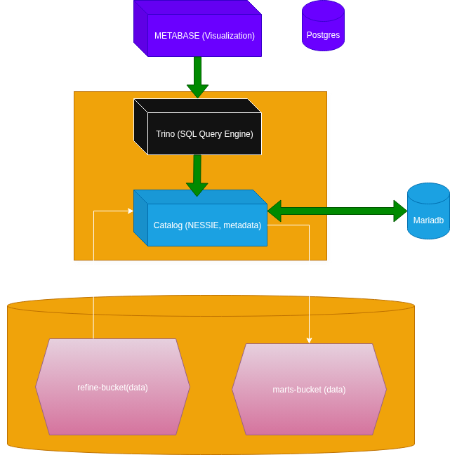
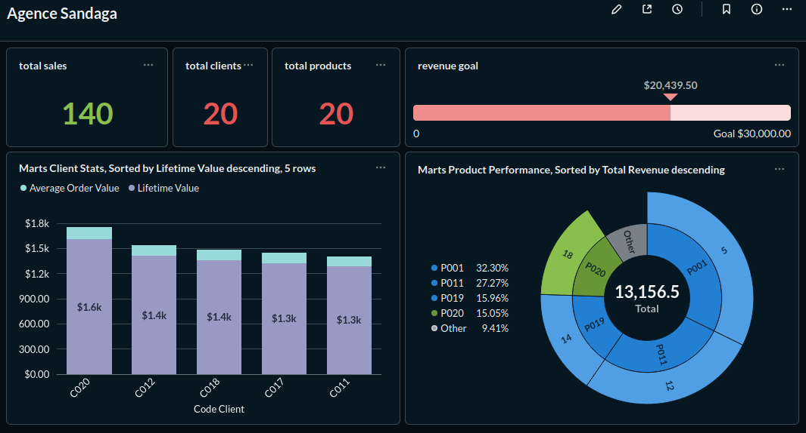

# 🦞 bigdata_nanp - METABASE - Visualisation (Metabase-trino) — BigData VIZ stack

## **Intro**

We are going to use **`MetaBase`** to look at some insights.

We are also going to use iceberg (nessie catalog) alongside **`Trino`** on top of **`Minio`**.

    <picture>
        <source media="(prefers-color-scheme: light dark)" srcset="images/archi.drawio.png">
        
    </picture>

---

## **PORTS & configs**

* **`UI`**:

  - **Metabase UI**: Default (http) -> `8080`, Exposed(http) -> `3400`. **`[http://localhost:3400]`**

---

    <picture>
        <source media="(prefers-color-scheme: light dark)" srcset="images/graph1.png">
        
    </picture>

---

Enjoy!

